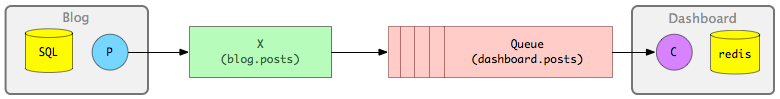

# Dashboard-sneakers

This is a example to asynchronous communication across RabbitMq, recive the event in a worker and persist the payload into redis.

## Setup

Just run the bundle install:

```bash
  bundle install
  yarn install --check-files
```

Create and bind the queue into RabbitMq

```bash
  rake rabbitmq:setup
```

Command for run the workers

```bash
  WORKERS=PostsWorker rake sneakers:run
```

To run the app:

```bash
  rails server
```
## Prerequisites:

* Rabbitmq: 
```bash
   -Install(DOCKER): docker run -d --hostname my-rabbit --name some-rabbit -p 15672:15672 -p 5672:5672 rabbitmq:3-management
```
```bash
   -Install(MAC OS): brew update / brew install rabbitmq
```
```bash
   -Install(LINUX): https://www.rabbitmq.com/install-debian.html
```
* Redis: 
```bash
   -Install(MAC OS): brew install redis
```

## Pending
- Install rspec
- Create tests

